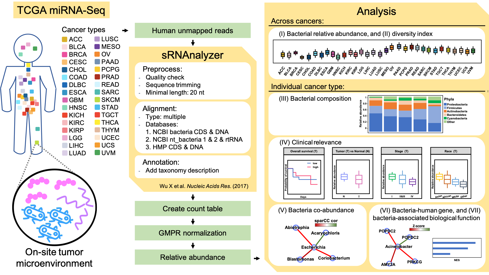

# BIC: a database for the transcriptional landscape of bacteria in cancer 

This repository contains source codes of BIC website and data processing. The parsed data can be downloaded directly from BIC database.

## Introduction

Microbial communities are massively resident in the human body, yet dysbiosis has been reported to correlate with many diseases, including various cancers. Most studies focus on the gut microbiome, while the bacteria that participate in tumor microenvironments on site remain unclear. Previous studies have acquired the bacteria expression profiles from RNA-seq, whole genome sequencing, and whole exon sequencing in The Cancer Genome Atlas (TCGA). However, small-RNA sequencing data were rarely used. Using TCGA miRNA sequencing data, we evaluated bacterial abundance in 32 types of cancer. To uncover the bacteria involved in cancer, we applied an analytical process to align unmapped human reads to bacterial references and developed the BIC database for the transcriptional landscape of bacteria in cancer. BIC provides cancer-associated bacterial information, including the relative abundance of bacteria, bacterial diversity, associations with clinical relevance, the co-expression network of bacteria and human genes, and their associated gene ontology. These results can complement previously published databases. Users can easily download the result plots and tables, or download the bacterial abundance matrix for further analyses. In summary, BIC can provide information on cancer microenvironments related to microbial communities. BIC is available at: http://bic.jhlab.tw/.

## Workflow

